# 標題：溫州街附近咖啡廳google評論字詞分析

author: 傅學恩

前端連結：待部署。本地可用 `streamlit run app.py` 啟動；後續建議部署至 Streamlit Community Cloud。

## 一、摘要

本作業以溫州街附近三家咖啡廳 `Rebirth`、`雪可屋`、`羊跳蚤` 的 Google Place reviews 為分析對象，建立一條從評論蒐集、資料庫儲存、字詞分析到前端檢視的完整流程。資料蒐集端以半自動 Playwright 為主，先由使用者手動登入並開到評論頁，再由程式接手抓取評論、展開全文與輸出 JSONL；資料層再將 JSONL 匯入 SQLite，作為查詢、分析與前端共同使用的資料來源。分析端目前完成了時間趨勢、整體 sentiment、aspect sentiment、詞頻、collocation、TF-IDF，以及一版 exploratory regression / correlation。前端則以 Streamlit 提供評論檢視、時間圖、單店分析與跨店比較。初步結果顯示，三家店整體都維持偏正向評價，但 `Rebirth` 在衛生與等待相關評論上較常出現負面訊號；`雪可屋` 與 `羊跳蚤` 則更明顯呈現飲品、氣氛與店內使用情境上的差異。整體而言，本系統已能支援基礎的評論監測、跨店比較與警訊探索，但仍受半手動爬取上限與規則式分析精度限制。

## 二、本作業資料來源與取得方法

本作業資料來源為 Google Maps 上三家溫州街附近咖啡廳的 Google Place reviews：

- `Rebirth`
- `雪可屋`
- `羊跳蚤`

### 取得方法

資料蒐集初期曾同時驗證 Selenium 與 Playwright。由於 Google Maps 對冷啟動自動化 session 的 UI 回應不穩，最終採用較穩定的半自動 Playwright 路線：

1. 先手動登入 Google 帳號並開到指定店家的評論頁。
2. 再由 Playwright 接手辨識評論 pane、展開評論全文、觸發 lazy-load。
3. 將單輪抓取結果輸出為 JSONL 與對應 debug artifact。

### 每家店蒐集欄位

每則評論目前至少保留以下指標：

- 店家識別：`place_id`、`place_name`、`source_url`
- 評論識別：`review_unique_key`、`review_id`
- 評論者與內容：`reviewer_name`、`review_text`
- 結構化資訊：`star_rating`、`review_date_text`、`review_date_estimated`
- 互動資訊：`likes_count`
- 店家回覆：`owner_response_text`、`owner_response_date`
- 匯入時間：`scraped_at`

### 各店目前資料量

目前 SQLite 中的評論數如下：

- `Rebirth`：360 則
- `雪可屋`：360 則
- `羊跳蚤`：203 則

這是資料庫中的原始累積量。後續文字分析會再排除空評論，因此進入 analysis pipeline 的筆數會略少於 SQLite 原始總筆數。

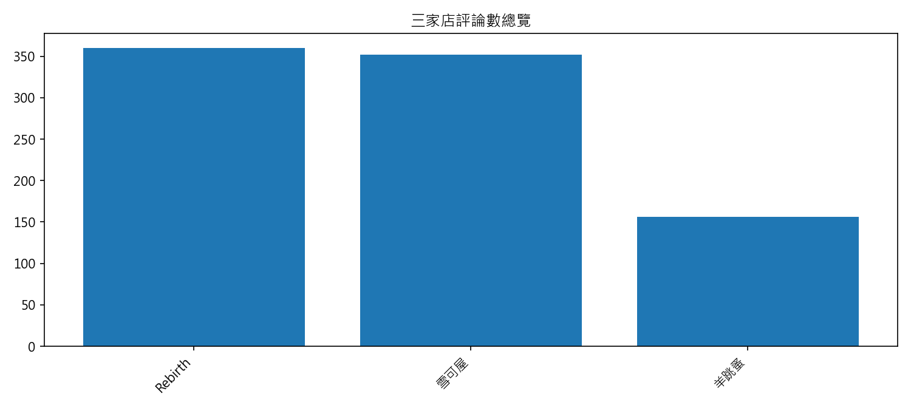

*圖 1. 三家店進入文字分析流程後的評論數總覽。此圖以有文字內容、可進入 sentiment / lexical pipeline 的評論為準，因此會略低於 SQLite 原始總筆數。*

## 三、本作業資料庫儲存方式

本專案目前採「原始 JSONL + SQLite」雙層儲存方式。

### 1. 原始資料

每次 Playwright 抓取後，先把單輪結果以 JSONL 保存在 `data/playwright/<place_id>/runs/`。這一層保留最接近原始抓取結果的資料，方便 debug、重匯入與後續欄位擴充。

### 2. SQLite 匯入

後續再將 JSONL 匯入到 `data/processed/google_place_reviews.db`。目前資料庫主要包含三張表：

- `places`
  - 儲存店家基本資訊
- `scrape_runs`
  - 儲存每次抓取 run 的來源與摘要
- `reviews`
  - 儲存可供查詢與分析的評論資料

### 3. 簡單資料流程

目前 pipeline 可概括為：

`Playwright 抓取 -> JSONL -> SQLite -> analysis outputs -> Streamlit`

### 4. 去重方式

目前資料庫匯入採基本去重邏輯：

- 以現有唯一鍵與既有評論識別欄位避免明顯重複匯入
- 同一評論再次匯入時，會以較新的資料覆蓋既有資料

這個做法已足夠支撐本次作業，但若未來要做長期更新，仍建議進一步加強：

- 多輪抓取的 cross-run dedup
- 文字較完整版本優先保留
- 更穩定的 `review_id` 對應策略

## 四、前端簡介

前端以 Streamlit 實作，目前主要分為兩個主功能區：

### 1. Reviews Explorer

??????????????????????

- ?????????
- ???? Google review ??
- ???????
- ????????????????????
- ??????????????

?? 9 ????????????????????????????

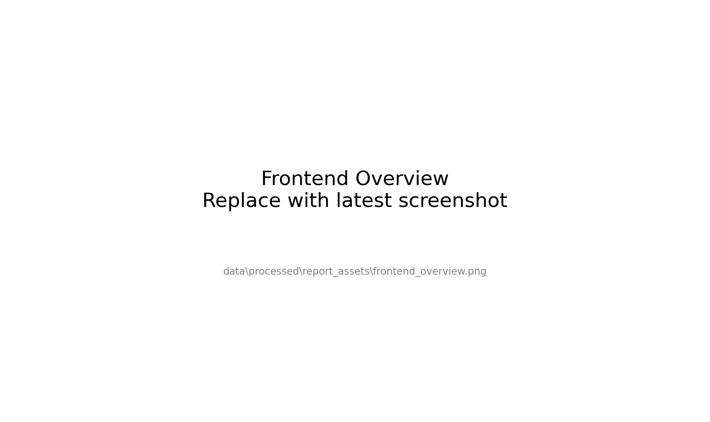

*? 9. ?????????????????????????????? Google review ???????????????????*

### 2. Opinion Analysis

????????????????????????????

- `??????`
  - ??????????????????????
- `??????`
  - ???????????????????

?? 10 ???????????????????????????????

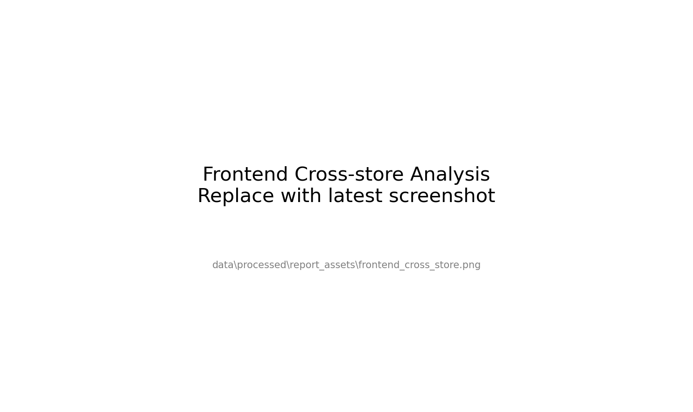

*? 10. ????????????????????????????? sentiment ????????????????*

?? 11 ???????????????????????????????

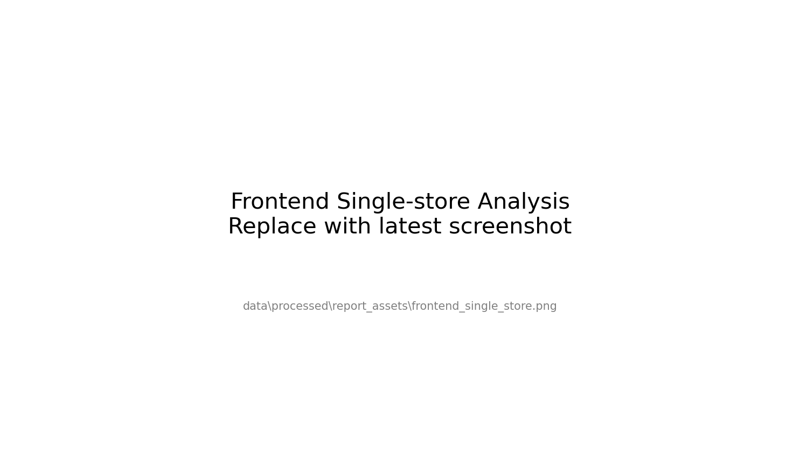

*? 11. ?????????????????????????????????aspect ???????? collocation ???*

???????????????????????

- ?????????
- ??? sanity check
- ???????????????
### 前端部署路線

本專案目前尚未正式上架，因此前端連結先標示為待部署。後續建議部署方式為：

1. 將專案推到 GitHub
2. 以 `app.py` 作為 Streamlit 入口
3. 保留 `requirements.txt` 與 `data/processed/analysis/` 的必要輸出
4. 透過 [Streamlit Community Cloud](https://streamlit.io/cloud) 建立部署

若暫時不部署，也可直接在本地使用：

```bash
streamlit run app.py
```

## 五、資料分析方法與結果

### 5.1 各店分析

#### a. 時間分析

時間分析目前主要使用：

- `review_date_estimated`
- `star_rating`

來計算：

- 每月評論數
- 每月平均星數
- 每年評論數
- 每年平均星數

以 `Rebirth` 為例，單店時間趨勢圖如圖 2 所示。`Rebirth` 的評論量在 2023–2025 間較集中，且 2025 年的平均星數有明顯下滑，代表即使總評論量仍高，評價品質也可能在特定時段出現波動。

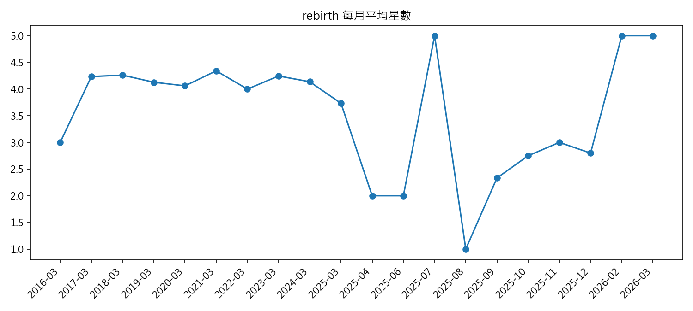

*圖 2. `Rebirth` 每月平均星數變化。2025 年中後段可觀察到較明顯的下滑。*

跨店時間比較如圖 3、圖 4 所示。圖 3 顯示三家店的評論活躍時間分布並不一致；圖 4 則可看出 `雪可屋` 與 `羊跳蚤` 的平均星數較穩定，而 `Rebirth` 在部分時間區段有較大波動。

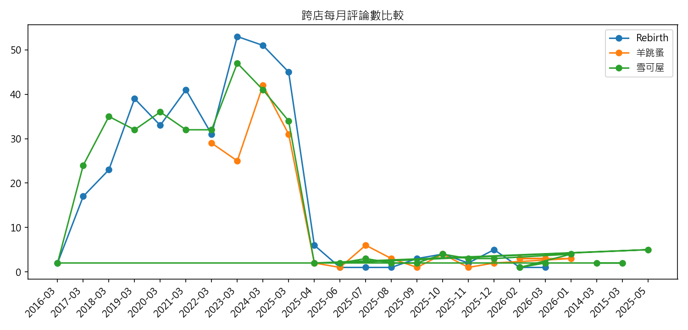

*圖 3. 三家店每月評論數比較。三家店的評論累積節奏不同，`Rebirth` 的評論量最高。*

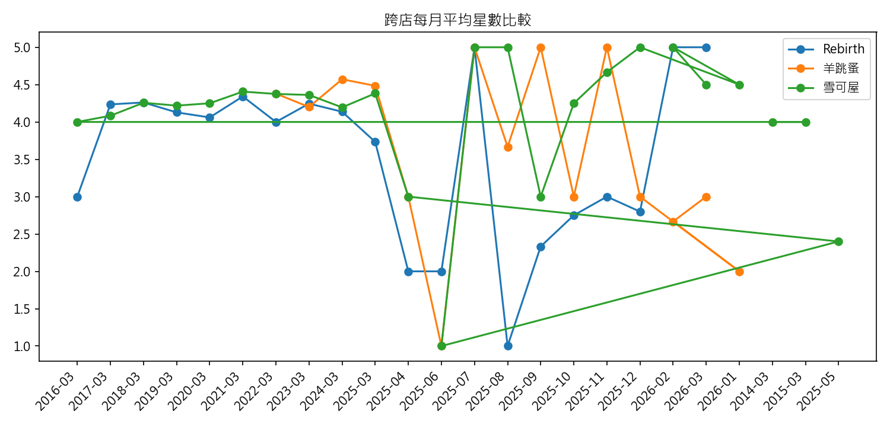

*圖 4. 三家店每月平均星數比較。`Rebirth` 的平均星數波動相對更大。*

#### b. 情緒分析

##### 方法 1：整體 sentiment analysis

整體 sentiment analysis 採第一版規則法：

- 使用正向詞、負向詞、否定詞與強度詞
- 對每則評論計算 `sentiment_score`
- 再轉成：
  - `positive`
  - `neutral`
  - `negative`

前端顯示時為了讓數值更容易閱讀，會再把規則分數轉成 `/10` 的形式，但這只是**展示轉換**，不是模型原始機率。

##### 方法 2：aspect sentiment analysis

面向情緒分析也採規則法，但比整體 sentiment 更細一層。目前流程是：

1. 先用 aspect 詞典判斷某則評論提到哪些面向
2. 將評論切成句段
3. 只在命中的句段內計算局部 sentiment
4. 再彙總成單店與跨店的面向提及次數與正負比例

目前第一版面向包括：

- 飲品
- 正餐
- 甜點
- 功能用途
- 氛圍/風格
- 店員/服務
- 價格
- 衛生/整潔
- 出餐速度

此外，Google 評論中常見的內建結構化評分：

- `餐點`
- `服務`
- `氣氛`

也會另外抽出，作為**獨立指標**，不直接混進文字情緒分數。

##### 情緒分析結果

三家店目前的整體情緒摘要如下：

| 店家 | 可分析評論數 | 平均 sentiment | 平均星數 | 正向比例 |
| --- | ---: | ---: | ---: | ---: |
| Rebirth | 360 | 1.122 | 4.014 | 60.3% |
| 雪可屋 | 352 | 0.847 | 4.247 | 52.3% |
| 羊跳蚤 | 156 | 0.734 | 4.244 | 44.2% |

從第一版結果來看：

- `Rebirth` 雖然整體星數略低於另外兩家，但文字正向比例仍然最高
- `雪可屋` 與 `羊跳蚤` 的平均星數接近，但 `羊跳蚤` 的文字評論中中性比例偏高
- 這表示星數與文字 sentiment 雖然相關，但不完全等價，文字層面的觀察仍有補充價值

跨店情緒分布如圖 5 所示。`Rebirth` 的正向比例最高，但負向比例也略高於另外兩家；`羊跳蚤` 的中性評論比例則最高。

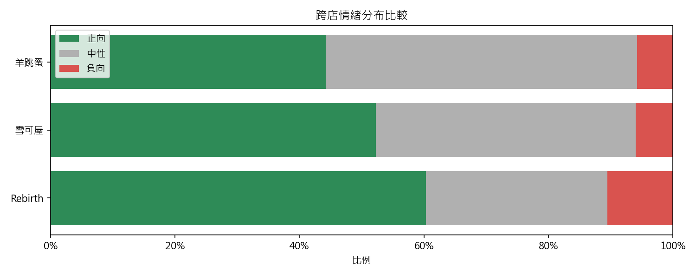

*圖 5. 三家店正向、中性、負向評論比例比較。`羊跳蚤` 的中性評論比例最高，`Rebirth` 的正向與負向比例都比較明顯。*

##### 單店面向結果

目前各店被提及最多的面向如下：

- `Rebirth`
  - 正餐（241）
  - 店員/服務（234）
  - 飲品（113）
- `雪可屋`
  - 飲品（220）
  - 正餐（149）
  - 店員/服務（130）
- `羊跳蚤`
  - 店員/服務（108）
  - 正餐（89）
  - 飲品（72）

這說明三家店雖然都屬咖啡廳，但評論重點並不完全相同：

- `Rebirth` 更像是「餐點 + 服務 + 飲品」都被大量討論
- `雪可屋` 的飲品提及量特別高
- `羊跳蚤` 的服務與店內氣氛感受存在較多存在感

共同面向比較如圖 6 所示。從圖中可以看出，`Rebirth` 在 `衛生/整潔` 與 `功能用途` 上較容易出現偏低分數，而 `雪可屋` 的 `飲品` 與 `氛圍/風格` 表現相對穩定。

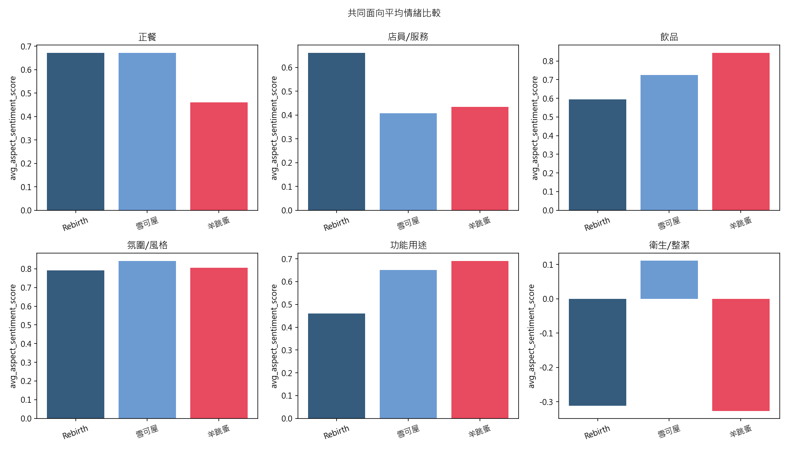

*圖 6. 共同面向平均情緒比較。不同店家在功能用途、衛生/整潔、飲品與服務等面向上的表現差異明顯。*

Google 內建評分目前的平均值則約為：

- `Rebirth`
  - 餐點：4.0
  - 服務：4.3
  - 氣氛：4.0
- `雪可屋`
  - 餐點：4.3
  - 服務：4.2
  - 氣氛：4.4
- `羊跳蚤`
  - 餐點：4.3
  - 服務：4.2
  - 氣氛：4.5

#### c. 詞頻分析

詞頻分析目前採 `jieba` 斷詞、停用詞過濾與 top-n 關鍵詞統計；此外，也補充了 collocation 分析，觀察關鍵詞出現在正向或負向語境中的代表原文。

目前跨店 TF-IDF 特色詞結果顯示：

- `Rebirth`
  - 餐點、服務、好吃、氣氛、晚餐
- `雪可屋`
  - 餐點、咖啡、服務、氣氛、爵士
- `羊跳蚤`
  - 餐點、服務、氣氛、咖啡、內用

這些結果與人工閱讀的感受相符：

- `雪可屋` 的特色詞中較容易出現 `咖啡`、`爵士`
- `羊跳蚤` 的評論會更常提到 `音樂`、`內用`、`提拉米蘇`
- `Rebirth` 的評論則更常圍繞餐點與整體用餐經驗

### 5.2 跨店比較

#### a. 時間比較

從圖 3、圖 4 可知，三家店不只是評論數不同，評分波動也不一致。`Rebirth` 的評論量與討論熱度最高，但平均星數波動也最大；`雪可屋` 與 `羊跳蚤` 雖然評論量略少，平均星數則相對穩定。

#### b. 情緒與面向比較

跨店比較最大的差異並不在「整體是否好評」，而在「好評與負評集中在哪些面向」：

- `Rebirth`
  - 正向評論很多，但與 `衛生/整潔`、`等待` 有關的負評也更突出
- `雪可屋`
  - 飲品與氛圍相關描述較穩定，整體星數也高
- `羊跳蚤`
  - 中性評論比例較高，顯示部分評論偏描述性而不是強烈讚或強烈批評

#### c. TF-IDF 特色詞比較

TF-IDF 特色詞比較有助於快速辨識每家店的風格差異。例如，`雪可屋` 的 `爵士`、`咖啡`，以及 `羊跳蚤` 的 `提拉米蘇` 與 `音樂`，都比單純看星數更能指出店家差異。

### 5.3 Exploratory regression / correlation

除了描述性統計與規則式情緒分析外，本作業也補做了一版 exploratory correlation / regression，用來觀察「哪些文字指標和星數比較有關聯」。這一段的目的不是做因果推論，而是回答：

- 整體 sentiment 和星數是否同方向變動？
- 哪些面向的 sentiment 和星數比較相關？
- 這些面向能不能作為第六段 warning signal 的輔助指標？

首先，整體 `sentiment_score` 與 `star_rating` 的 pooled Pearson correlation 為 `0.426`，屬中度正相關；散點圖如圖 7 所示，整體 sentiment 越高，星數通常也越高，但仍存在相當多離散點，因此不能把 sentiment 直接視為星數替代品。

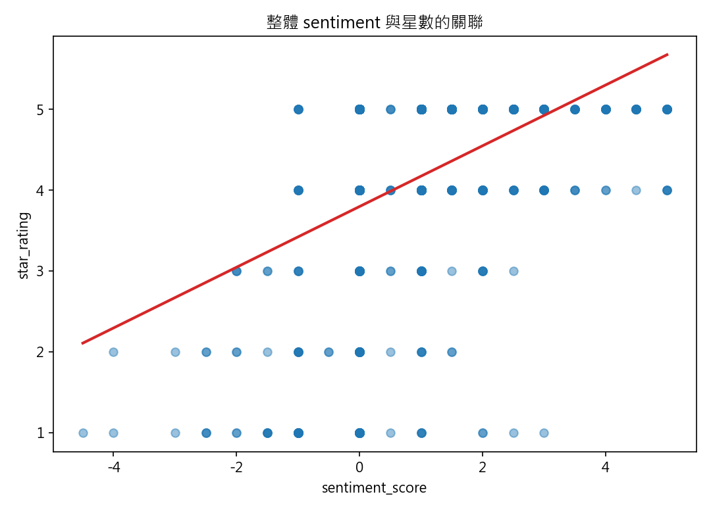

*圖 7. 所有評論的整體 sentiment 與星數散點圖。整體趨勢呈正相關，但離散程度仍高。*

再看各面向的 Pearson correlation，如圖 8 所示。若只看 pooled 結果，`價格`、`功能用途`、`出餐速度`、`衛生/整潔` 的相關係數相對較高，但 `價格` 與 `出餐速度` 的樣本數較少，因此解讀時必須特別保守；相對而言，`衛生/整潔`、`飲品`、`店員/服務` 比較同時具備可解釋性與足夠樣本。

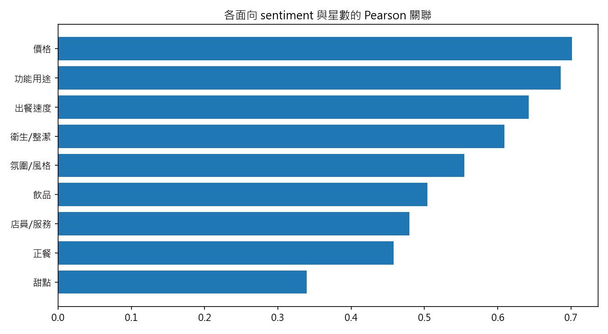

*圖 8. 各面向 sentiment 與星數的 Pearson correlation。部分面向雖相關較高，但樣本數較少，因此只能作探索性參考。*

表 1 為回歸模型摘要。以 pooled model 而言，單獨用整體 `sentiment_score` 預測 `star_rating` 的 `R^2` 約為 `0.181`；若改用九個 aspect sentiment 分數，`R^2` 約為 `0.145`。這表示第一版規則式文字特徵確實能解釋部分星數差異，但仍不足以完整預測星數。

| 表 1. 回歸模型摘要 | 樣本數 | R^2 | 調整後 R^2 |
| --- | ---: | ---: | ---: |
| 全體：`star_rating ~ sentiment_score` | 868 | 0.181 | 0.180 |
| 全體：`star_rating ~ 各面向 sentiment` | 868 | 0.145 | 0.136 |
| Rebirth：`star_rating ~ sentiment_score` | 360 | 0.264 | 0.262 |
| 雪可屋：`star_rating ~ sentiment_score` | 352 | 0.130 | 0.128 |
| 羊跳蚤：`star_rating ~ sentiment_score` | 156 | 0.122 | 0.117 |

表 2 則列出 pooled aspect model 中較值得解讀的係數。係數為正代表：**當該面向被描述得更正向時，評論星數通常也更高**。例如，`衛生/整潔` 的係數最高且顯著，表示衛生相關敘述對星數的拉動效果最明顯；`店員/服務` 與 `飲品` 也呈現顯著正向關聯。

| 表 2. pooled aspect regression 的主要係數 | 係數 | p-value |
| --- | ---: | ---: |
| 衛生/整潔 | 0.704 | < 0.001 |
| 店員/服務 | 0.213 | 0.002 |
| 飲品 | 0.130 | 0.020 |

## 六、評論語料如何支援意見分析與警訊判讀

### 1. warning signals

從目前結果來看，warning signal 可以由三層訊號交叉辨識：

- 時間面：平均星數是否在某一段時間明顯下降
- 面向面：某個面向的負向比例是否持續偏高
- 互動面：高按讚的負面評論是否反覆提及同一問題

以 `Rebirth` 為例，圖 2 顯示其平均星數在 2025 年有明顯下滑；而圖 6 與表 2 又顯示 `衛生/整潔` 是與星數關聯最強、也最值得關注的面向之一。實際評論中，也確實能看到相符的內容。例如有評論直接指出「從裡到外都很髒，曾在店內看到老鼠跑過客人的桌椅」，也有評論提到「環境真的很髒亂，已經超出老舊的範圍，而是根本沒有用心打掃清潔」。這類評論同時具備明確的問題描述、負向情緒與可行動性，因此可被視為高風險警訊。

另一個警訊則是等待時間。例如有評論指出「朋友都吃完了，我的都還沒上」，也有評論提到「等了不知道多久，點的飲品與收餐都沒有發生」。這些文字雖然未必在 pooled regression 中最顯著，但在店家經營上仍是可行動的服務流程訊號。

### 2. 哪些評論需要回應

目前系統最適合優先標記、並建議店家回應的評論類型包括：

- 明確抱怨衛生、服務、等待、餐點品質
- 高按讚且負面的評論
- 同一問題反覆出現的評論

例如前述 `Rebirth` 的衛生評論，因為涉及老鼠、廚房衛生與清潔管理，不只影響個人觀感，也可能對其他讀者造成高度風險感知，因此應優先回應。另一則值得回應的評論則是「正餐需要等就有心理準備，但結果真的等很久，朋友都吃完了我的都還沒上」，這類評論已明確指出問題、提供具體情境，也容易引發其他消費者共鳴，因此比單純情緒性批評更值得正式回應。

### 3. 哪些評論可以暫時忽略

相對地，以下類型的評論可以暫時排在較低優先序：

- 缺少具體資訊、只有單一句感受的短評論
- 沒有可行動線索的低互動零碎抱怨
- 單純表達喜歡或不喜歡，但沒有補充原因的評論

例如 `羊跳蚤` 的評論中有非常短的正向留言如「酷」、「音樂讚死!!!」，這類評論可作為整體口碑參考，但無法直接轉化成經營改善建議。同理，若出現只有一句「有點臭」但沒有描述時間、位置或來源的留言，也可以先列為低優先序，待後續出現更多相似評論再提升警戒層級。

## 七、若將此系統發展為商業化資訊服務

若將本系統進一步發展為可對外提供的資訊服務，較合理的方向包括以下四類：

### 1. 評論監測與比較平台

系統可延伸成店家評論比較平台，讓使用者或品牌方比較不同店家、不同時段與不同面向的表現，而不是只看 Google 星數。這種平台也可進一步納入其他地點類型，例如餐廳、書店、酒吧或展演空間。

### 2. 店家經營警訊儀表板

若把本作業目前的時間趨勢、面向負向比例與高風險評論整合成 dashboard，就可以作為店家經營警訊儀表板。例如，當某家店的衛生相關負評在最近三個月上升，或等待相關負評集中增加時，系統可以主動提醒管理者。

### 3. 互動式搜尋與推薦服務

之後若結合 LLM 與 RAG，系統可根據現有評論語料回答使用者更細緻的問題，例如：

- 哪家餐點特別好吃？
- 哪家比較適合讀書？
- 哪家音樂風格較突出？

這樣的功能比單純星數搜尋更貼近真實使用情境。

### 4. 自助式資料匯入與比較空間

未來也可提供使用者自行蒐集與管理比較集合的功能。例如，使用者可自己新增一組「台大附近深夜咖啡廳」或「台北適合讀書的店」，系統再對該子集合套用相同分析流程，形成個人化比較空間。

## 八、附錄：遭遇問題與解決方式

本專案從爬取到分析大致經歷了以下問題與修正：

1. **Google Maps 入口不穩**  
   初期曾嘗試直接用原始 place URL 與 `review-intent` URL 進入評論頁，但 Google Maps 會根據 session 狀態回傳不完整 UI，導致評論 pane 無法穩定出現。

2. **Selenium 冷啟動流程容易受反爬影響**  
   Selenium 在未登入、冷啟動與頻繁測試的狀態下較容易遇到降級 UI，因此後續改以 Playwright 驗證更接近真人操作的半自動流程。

3. **改成手動登入後接手**  
   在多輪實驗後，最穩定的流程是：先由使用者登入 Google 帳號並手動打開店家評論頁，再由 Playwright 接手辨識評論 pane、展開評論全文與觸發 lazy-load。

4. **評論全文與 lazy-load 問題**  
   早期資料中存在長評論被截斷、以及 lazy-load 未完全觸發的情況，後續透過「先展開更多」與多輪 scroll strategy 改善。

5. **資料層與前端分析整合**  
   在資料蒐集穩定後，再將 JSONL 匯入 SQLite，並建立 analysis pipeline 與 Streamlit 前端。這使系統不只是一個爬蟲，而是具備「資料儲存 -> 分析 -> 檢視」的一整套流程。
